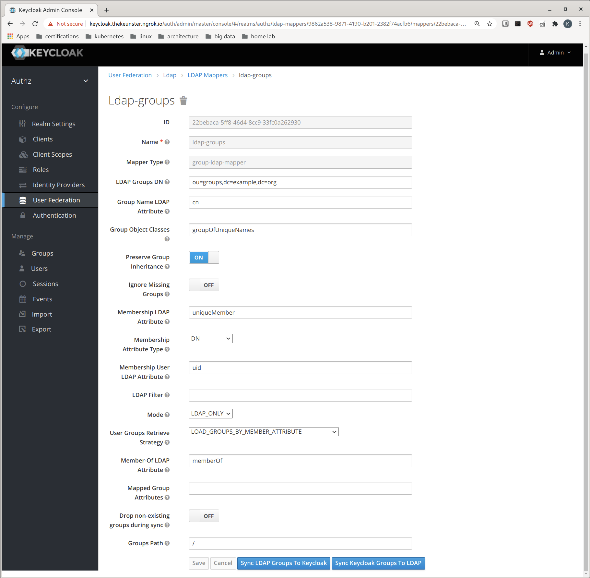
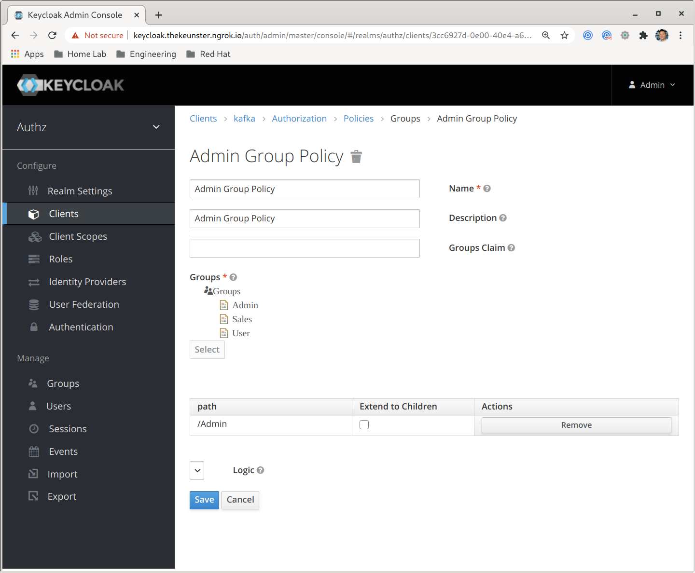
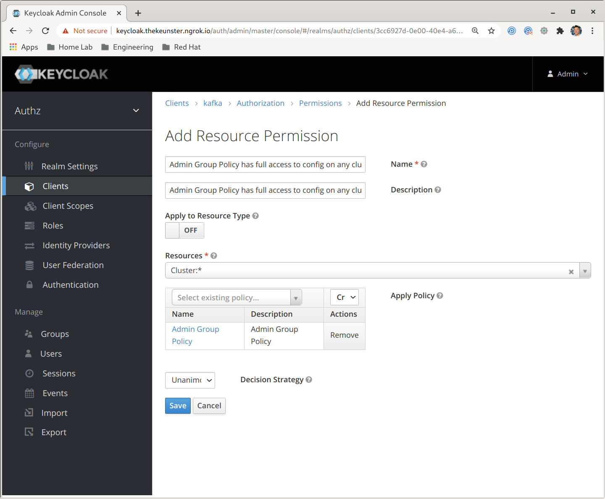

# Strimzi + Keycloak + LDAP: Broker Authorization Use Case

This use case demonstrates the following features: 

- TLS OAuth2.0 Authentication with Kafka
- TLS OAuth2.0 Authorization with Kafka
- Keycloak and LDAP User/Group integration
- Kafka Broker Authorization using Keycloak 

## Prerequisites

make sure you have an accessible kubernetes cluster: 

- kubernetes cluster
  - Load Balancers must be deployed/enabled (i.e. metallb, traefik, etc.)

make sure the following are installed added to your PATH: 

- [kubectx/kubens](https://github.com/ahmetb/kubectx)
- [kubectl](https://kubernetes.io/docs/tasks/tools/install-kubectl/)
- [helm 3](https://helm.sh/docs/intro/install/)

## Infastructure

The infrastructure to be created will consist of the following components: 

- OpenLDAP
- Keycloak/RHSSO
- Strimzi/AMQ Streams Kafka Cluster

NOTE: you will need to have the following namespaces available for use in this demo. 

```
openldap
kafka
clients
```

to install an entire ready made infrastructure: 

```bash
./setup.sh
```

# Importing LDAP Users and Groups into Keycloak

## Add an LDAP Provider and Import Users

You can access keycloak leveraging a proxy. one way to do to this is via port-forwarding your keycloak pod. 

```bash
# example - accessible at: https://localhost:8443
# obtain keycloak pod name. i.e. keycloak-69689547-fmn6h
kubectl port-forward keycloak-69689547-fmn6h 8443:8443
```

1) Login to the main Keycloak dashboard: `u:admin, p:admin`

2) Select realm: `authz`

3) Select `User Federation` and then `ldap` from the provider drop down

4) Match your screen configuration to the illustration below


We are using OpenLDAP as our LDAP provider in this example, hence the screen configurations will be specific to configuring OpenLDAP. 

Between other LDAP Providers, these configurations will differ. 

5) click `save`, then click `Synchronize all users`

## Import LDAP Groups

1) select `User Federation` and then `ldap` 
2) select `Mappers`
3) click `create` and fill in with the following values: 



4) click `save` and then `Sync LDAP Groups to Keycloak`

You can validate our LDAP users and groups by clicking on the `Users` and `Groups` tabs. 

You should see the following users: 


and groups: 


# Broker Authorization

The following use cases will demonstrate how to create various broker authorization resources, policies, and permissions and test them via kafka consumer/producer tools. 

We will add authorization rules on the `Admin` LDAP group we synchronized earlier. Observing the users in the group we see the group has two users, `kermit` and `fozzie`. 

For each of the use cases below we will define/identify the following in Keycloak. 

## Admin Group Policy has full access to manage and affect consumer groups

**Resources**: `Group:*` 

(exists, no need to create)

**Policies**: 

- Name/Description: `Admin Group Policy`
- Groups: `Admin`
- Policy Type: `Group`



**Permissions**: 

- Name/Description: `Admin Group Policy has full access to manage and affect consumer groups`
- Type: `Resource`
- Resource: `Group:*`
- Policy: `Admin Group Policy`
- Decision Strategy: `Unanimous`


## Admin Group Policy has full access to manage and affect producer topics

**Resources**: `Topic:*`

(exists, no need to create)

**Policies**: `Admin Group Policy`

(exists, created in previous use case, no need to create)

**Permissions**: 

- Name/Description: `Admin Group Policy has full access to manage and affect producer topics`
- Type: `Resource`
- Resource: `Topic:*`
- Policy: `Admin Group Policy`
- Decision Strategy: `Unanimous`


## Admin Group Policy has full access to config on any cluster

**Resources**: `Cluster:*`

(exists, no need to create)

**Policies**: `Admin Group Policy`

(exists, created in previous use case, no need to create)

**Permissions**: 

- Name/Description: `Admin Group Policy has full access to config on any cluster`
- Type: `Resource`
- Resource: `Cluster:*`
- Policy: `Admin Group Policy`
- Decision Strategy: `Unanimous`



## Testing Authorization Rules for Admin Group Policy

Follow the comments in the script below: 

```bash
# switch to the `clients` namespace
kubens clients

# check the running pods
# you should see a single running pod: kafka-client-shell
kubectl get po

# terminal into the pod
kubectl exec -it kafka-client-shell -- /bin/bash
```

From this point on, you will be terminaled into the pod. Continue to follow the script:  

Setup your TLS environment:

```bash
# set up your TLS environment
export PASSWORD=truststorepassword
export KAFKA_OPTS=" \
  -Djavax.net.ssl.trustStore=/opt/kafka/certificates/kafka-client-truststore.p12 \
  -Djavax.net.ssl.trustStorePassword=$PASSWORD \
  -Djavax.net.ssl.trustStoreType=PKCS12"
```

add your token endpoint to the environment: 

```bash
# add TOKEN ENDPOINT to env
export TOKEN_ENDPOINT=https://keycloak.keycloak:8443/auth/realms/kafka-authz/protocol/openid-connect/token
```

create JWT for the user "kermit"

```bash
# generate an oauth2 jwt and validate the token - make sure you're not getting back gibberish - user kermit
REFRESH_TOKEN=$(~/bin/oauth.sh -q kermit) # password: pass
~/bin/jwt.sh $REFRESH_TOKEN
```

generate oauth user properties for "kermit"

```bash
# generate oauth user properties - kermit
cat > ~/kermit.properties << EOF
security.protocol=SASL_SSL
sasl.mechanism=OAUTHBEARER
sasl.jaas.config=org.apache.kafka.common.security.oauthbearer.OAuthBearerLoginModule required \
  oauth.refresh.token="$REFRESH_TOKEN" \
  oauth.client.id="kafka-cli" \
  oauth.token.endpoint.uri="https://keycloak.keycloak:8443/auth/realms/kafka-authz/protocol/openid-connect/token" ;
sasl.login.callback.handler.class=io.strimzi.kafka.oauth.client.JaasClientOauthLoginCallbackHandler
EOF
```

using the oauth properites file we created, this will allow "kermit" to produce messages on the topic "my-topic". 

go ahead and generate some messages then hit ctrl-c to exit. 

```bash
# kermit produces messages on "my-topic"
bin/kafka-console-producer.sh --broker-list my-cluster-kafka-bootstrap.kafka:9093 --topic my-topic --producer.config ~/kermit.properties
```

generate an oauth2 jwt and validate the token - make sure you're not getting back gibberish - user fozzie

```bash
# generate an oauth2 jwt and validate the token - make sure you're not getting back gibberish - user fozzie
REFRESH_TOKEN=$(~/bin/oauth.sh -q fozzie) # password: pass
~/bin/jwt.sh $REFRESH_TOKEN
```

generate oauth user properties for "fozzie"

```bash
# generate oauth user properties - fozzie
cat > ~/fozzie.properties << EOF
security.protocol=SASL_SSL
sasl.mechanism=OAUTHBEARER
sasl.jaas.config=org.apache.kafka.common.security.oauthbearer.OAuthBearerLoginModule required \
  oauth.refresh.token="$REFRESH_TOKEN" \
  oauth.client.id="kafka-cli" \
  oauth.token.endpoint.uri="https://keycloak.keycloak:8443/auth/realms/kafka-authz/protocol/openid-connect/token" ;
sasl.login.callback.handler.class=io.strimzi.kafka.oauth.client.JaasClientOauthLoginCallbackHandler
EOF
```

using the oauth properites file we created, this will allow "fozzie" to consume messages on the topic "my-topic". 

you should see messages the "kermit" produced earlier. hit ctrl-c to exit. 

```bash
# fozzie consumes messages that kermit produced
bin/kafka-console-consumer.sh --bootstrap-server my-cluster-kafka-bootstrap.kafka:9093 --topic my-topic  --from-beginning --consumer.config ~/kermit.properties
```

or follow along in the asciinema recording below: 

[](https://asciinema.org/a/vLmnBu6NagKAfdwnmoi7pkwDG)

# Sources

https://www.janua.fr/mapping-ldap-group-and-roles-to-redhat-sso-keycloak/
https://www.keycloak.org/docs/6.0/server_admin/
https://robferguson.org/blog/2019/12/29/angular-openid-connect-keycloak/
https://robferguson.org/blog/2020/01/03/keycloak-flowable-and-openldap/
https://robferguson.org/blog/2019/01/28/how-to-flowable-and-ldap/
http://www.mastertheboss.com/jboss-frameworks/keycloak/keycloak-oauth2-example-with-rest-application
https://strimzi.io/docs/operators/latest/full/using.html#assembly-oauth-authentication_str
https://strimzi.io/docs/operators/latest/full/using.html#assembly-oauth-authorization_str
https://strimzi.io/blog/2019/10/25/kafka-authentication-using-oauth-2.0/
https://github.com/strimzi/strimzi-kafka-oauth/blob/master/examples/README-authz.md
https://github.com/strimzi/strimzi-kafka-oauth#building