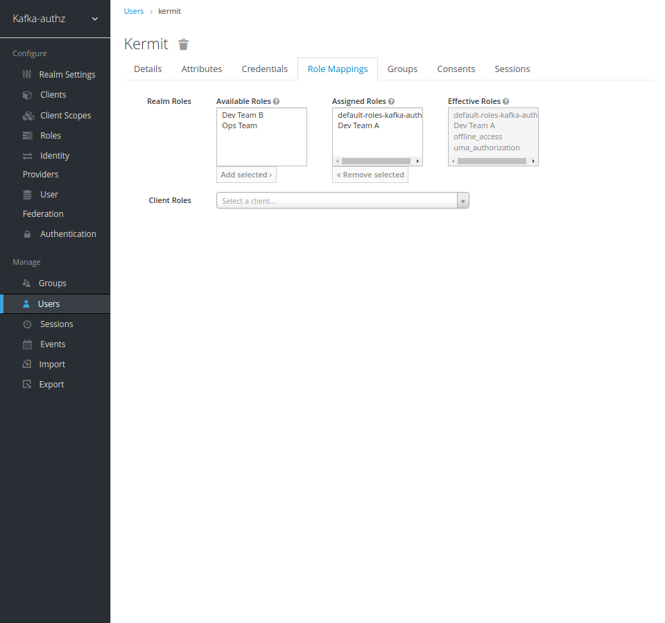
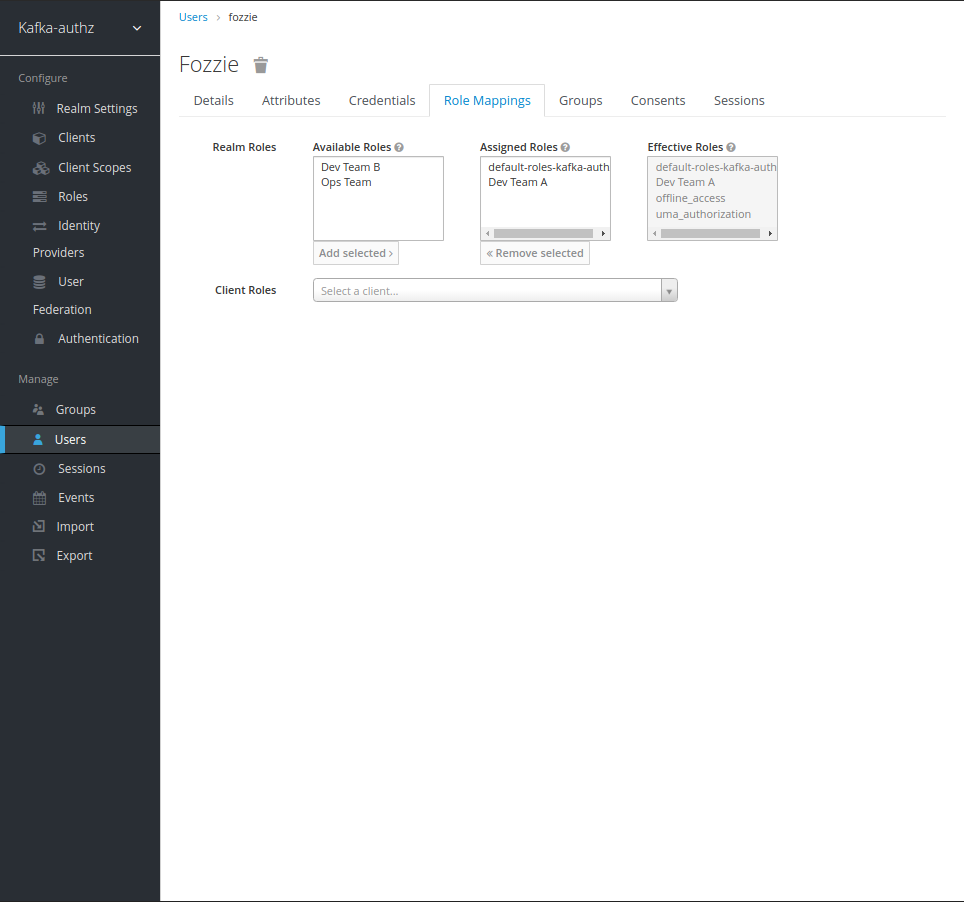

# Kafka Broker Authorization Setup and Test

## Assign User Role Mappings in Keycloak/RH SSO

Map "Kermit" to "Dev Team A"



Map "Fozzie" to "Dev Team A"



## Create a Kafka Topic

```bash
cat <<EOF | kubectl apply -f -
kind: KafkaTopic
apiVersion: kafka.strimzi.io/v1beta2
metadata:
  name: a-topic
  labels:
    strimzi.io/cluster: my-cluster
  namespace: kafka
spec:
  partitions: 10
  replicas: 3
  config:
    retention.ms: 604800000
    segment.bytes: 1073741824
EOF
```

## Terminal into the `kafka-client-shell` Pod

**Kubernetes**

```bash
# switch to the `kafka` namespace
kubens kafka

# check the running pods
# you should see the following running pod: kafka-client-shell
kubectl -n kafka get po

# terminal into the pod
kubectl exec -it kafka-client-shell -- /bin/bash
```

**Openshift**

Make a note of the RH SSO Openshift Route

```bash
# IMPORTANT!! Get RH SSO/Keycloak Openshift Route -- Make a note of this
# i.e. keycloak-keycloak.apps.openshift-domain.com
# you will need this value a few steps later
oc -n keycloak get routes keycloak -o jsonpath='{ .spec.host }'
```

```bash
# switch to the `kafka` namespace
kubens kafka

# check the running pods
# you should see the following running pod: kafka-client-shell
oc -n kafka get po

# terminal into the pod
oc rsh -n kafka kafka-client-shell bin/bash
```

## Kafka OAuth Tests

From this point on, you will be terminaled into the pod. Continue to follow the script:  

Setup your TLS environment:

```bash
# set up your TLS environment
export PASSWORD=truststorepassword
export KAFKA_OPTS=" \
  -Djavax.net.ssl.trustStore=/opt/kafka/certificates/kafka-client-truststore.p12 \
  -Djavax.net.ssl.trustStorePassword=$PASSWORD \
  -Djavax.net.ssl.trustStoreType=PKCS12"
```

Add your token endpoint to the environment: 

**Kubernetes**

```bash
# add TOKEN ENDPOINT to env
export TOKEN_ENDPOINT=https://keycloak.keycloak:8443/auth/realms/kafka-authz/protocol/openid-connect/token
```

**Openshift**

```bash
# IMPORTANT!! get value of RH SSO Route from previous steps and replace here:
export RH_SSO_OCP_ROUTE=<keycloak-keycloak.apps.openshift-domain.com>

# add TOKEN ENDPOINT to env
export TOKEN_ENDPOINT=https://$RH_SSO_OCP_ROUTE/auth/realms/kafka-authz/protocol/openid-connect/token
```

Create JWT for the user "kermit"

```bash
# generate an oauth2 jwt
REFRESH_TOKEN=$(~/bin/oauth.sh -q kermit) # password: pass
```

```bash
# validate the token - make sure you're not getting back gibberish

~/bin/jwt.sh $REFRESH_TOKEN
```

Generate oauth user properties for "kermit"

```bash
# generate oauth user properties - kermit
cat > ~/kermit.properties << EOF
security.protocol=SASL_SSL
sasl.mechanism=OAUTHBEARER
sasl.jaas.config=org.apache.kafka.common.security.oauthbearer.OAuthBearerLoginModule required \
  oauth.refresh.token="$REFRESH_TOKEN" \
  oauth.client.id="kafka-cli" \
  oauth.token.endpoint.uri="$TOKEN_ENDPOINT" ;
sasl.login.callback.handler.class=io.strimzi.kafka.oauth.client.JaasClientOauthLoginCallbackHandler
EOF
```

Using the oauth properties file we created, this will allow "kermit" to produce messages on the topic "a-topic". 

Go ahead and generate some messages then hit ctrl-c to exit. 

```bash
# kermit produces messages on "my-topic"
bin/kafka-console-producer.sh --broker-list my-cluster-kafka-bootstrap.kafka:9093 --topic a-topic --producer.config ~/kermit.properties
```

Generate an oauth2 jwt and validate the token - make sure you're not getting back gibberish - user fozzie

```bash
# generate an oauth2 jwt
REFRESH_TOKEN=$(~/bin/oauth.sh -q fozzie) # password: pass
```

```bash
# validate the token - make sure you're not getting back gibberish
~/bin/jwt.sh $REFRESH_TOKEN
```

Generate oauth user properties for "fozzie"

```bash
# generate oauth user properties - fozzie
cat > ~/fozzie.properties << EOF
security.protocol=SASL_SSL
sasl.mechanism=OAUTHBEARER
sasl.jaas.config=org.apache.kafka.common.security.oauthbearer.OAuthBearerLoginModule required \
  oauth.refresh.token="$REFRESH_TOKEN" \
  oauth.client.id="kafka-cli" \
  oauth.token.endpoint.uri="$TOKEN_ENDPOINT" ;
sasl.login.callback.handler.class=io.strimzi.kafka.oauth.client.JaasClientOauthLoginCallbackHandler
EOF
```

Using the oauth properites file we created, this will allow "fozzie" to consume messages on the topic "a-topic". 

You should see messages that "kermit" produced earlier. hit ctrl-c to exit. 

```bash
# fozzie consumes messages that kermit produced
bin/kafka-console-consumer.sh --bootstrap-server my-cluster-kafka-bootstrap.kafka:9093 --topic a-topic --group a_consumer_group_001  --from-beginning --consumer.config ~/fozzie.properties
```

## Further Validation

At this point, you can modify the rolemappings to the sample users we've used so far and validate their access after removing rolemappings from one or more of the users. 