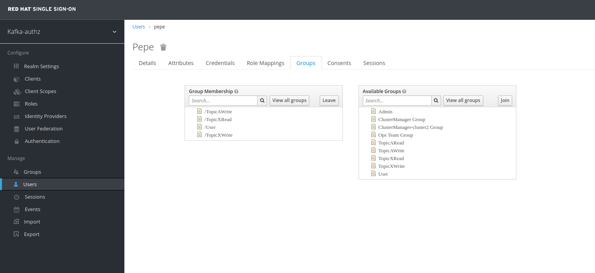
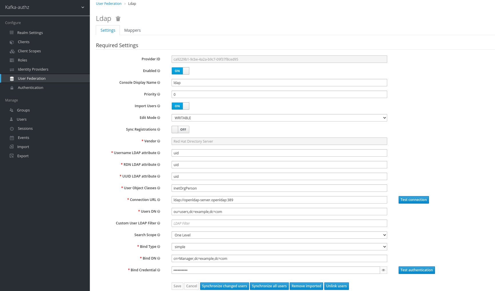

# Auth Test from LDAP to Kafka via RH-SSO

## Update LDAP User's Group Assignment

Note: Pepe is in TopicAWrite, TopicXRead and TopicXWrite




## Test Authorization for Pepe - Read from a-topic - Not Authorized

Create token for Pepe [as created for kermit](KAFKA-OAUTH-TEST.md)

Write to a-topic as pepe [as kermit wrote to a-topic](KAFKA-OAUTH-TEST.md)

Read from a-topic as pepe [as fozzie read from a-topic](KAFKA-OAUTH-TEST.md)

Read should give an error 
```bash
org.apache.kafka.common.errors.GroupAuthorizationException: Not authorized to access group: a_consumer_group_001
Processed a total of 0 messages
```

## Add Pepe to TopicARead Group

**Kubernetes**

```bash
# Get Openldap POD
openldap_pod=$(kubectl get po -l app=openldap-server -o custom-columns=:metadata.name)
openldap_pod=`echo $openldap_pod | xargs`

# Add Pepe to TopicARead Group in OpenLDAP
kubectl exec -it $openldap_pod -- /bin/bash -c 'ldapmodify -x -H ldap://openldap-server.openldap:389 -D "cn=Manager,dc=example,dc=com" -w admin -f /tmp/add-pepe-to-read.ldif'


```

**Openshift**


```bash
# Get Openldap POD
OPENLDAP_POD=$(oc -n openldap get po -l deploymentconfig=openldap-server -o custom-columns=:metadata.name)
OPENLDAP_POD=`echo $OPENLDAP_POD | xargs`

# Add Pepe to TopicARead Group in OpenLDAP
oc -n openldap exec -it $OPENLDAP_POD -- /bin/bash -c 'ldapmodify -x -H ldap://openldap-server.openldap:389 -D "cn=Manager,dc=example,dc=com" -w admin -f /tmp/add-pepe-to-read.ldif'

```

## Refresh Keycloak

Click "Synchronize all users" button under User Federation -> ldap




## Pepe to read from a-topic  - Authorized
Read from a-topic as pepe [as fozzie read from a-topic](KAFKA-OAUTH-TEST.md)

No errors this time

## Remove Pepe from TopicARead Group

**Kubernetes**

```bash
# Get Openldap POD
openldap_pod=$(kubectl get po -l app=openldap-server -o custom-columns=:metadata.name)
openldap_pod=`echo $openldap_pod | xargs`

# Add Pepe to TopicARead Group in OpenLDAP
kubectl exec -it $openldap_pod -- /bin/bash -c 'ldapmodify -x -H ldap://openldap-server.openldap:389 -D "cn=Manager,dc=example,dc=com" -w admin -f /tmp/remove-pepe-from-read.ldif'


```

**Openshift**


```bash
# Get Openldap POD
OPENLDAP_POD=$(oc -n openldap get po -l deploymentconfig=openldap-server -o custom-columns=:metadata.name)
OPENLDAP_POD=`echo $OPENLDAP_POD | xargs`

# Add Pepe to TopicARead Group in OpenLDAP
oc -n openldap exec -it $OPENLDAP_POD -- /bin/bash -c 'ldapmodify -x -H ldap://openldap-server.openldap:389 -D "cn=Manager,dc=example,dc=com" -w admin -f /tmp/remove-pepe-from-read.ldif'

```

## Refresh Keycloak

Click "Synchronize all users" button under User Federation -> ldap


## Pepe to read from a-topic - Not Authorized 
Read from a-topic as pepe [as fozzie read from a-topic](KAFKA-OAUTH-TEST.md)

Read should give an error 
```bash
org.apache.kafka.common.errors.GroupAuthorizationException: Not authorized to access group: a_consumer_group_001
Processed a total of 0 messages
```


