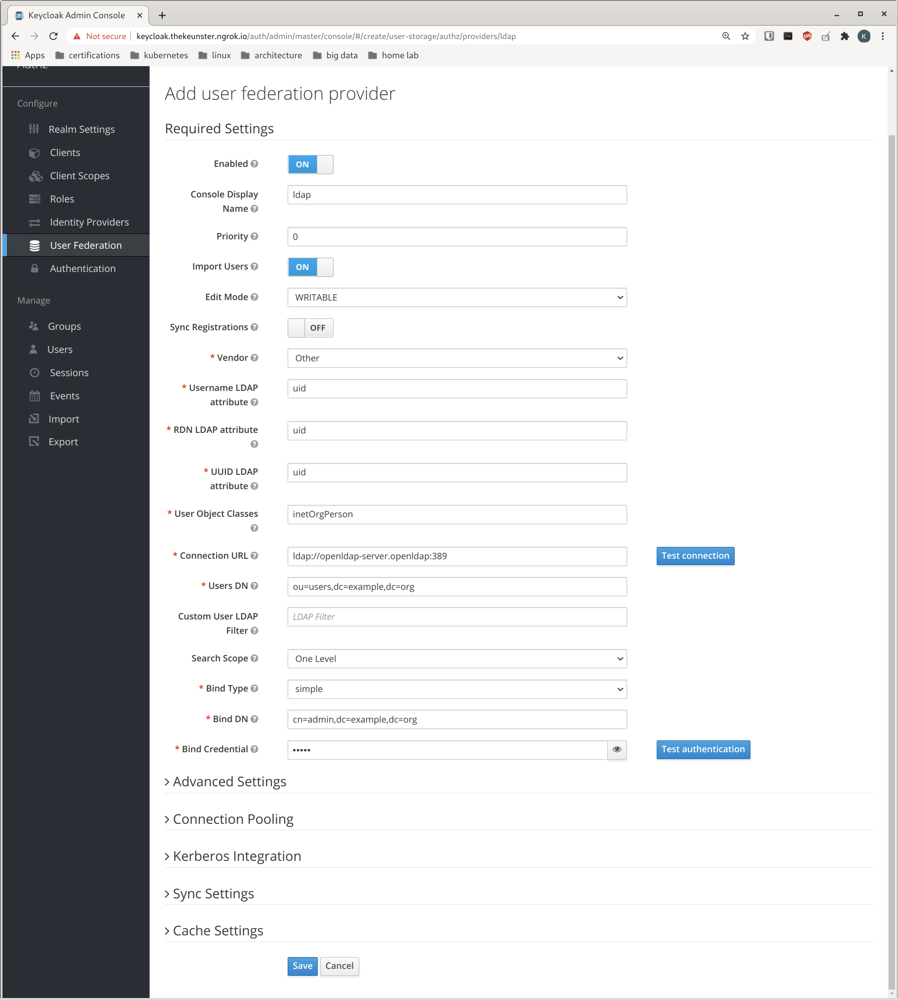
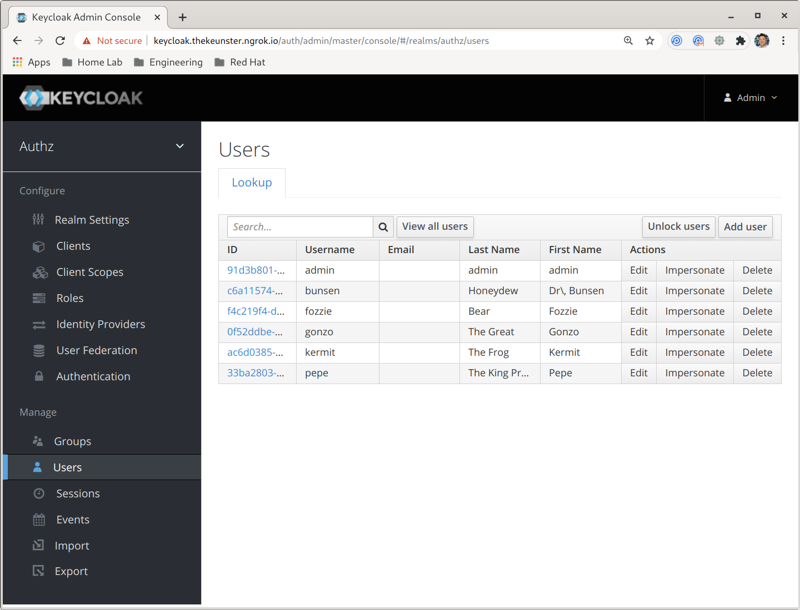
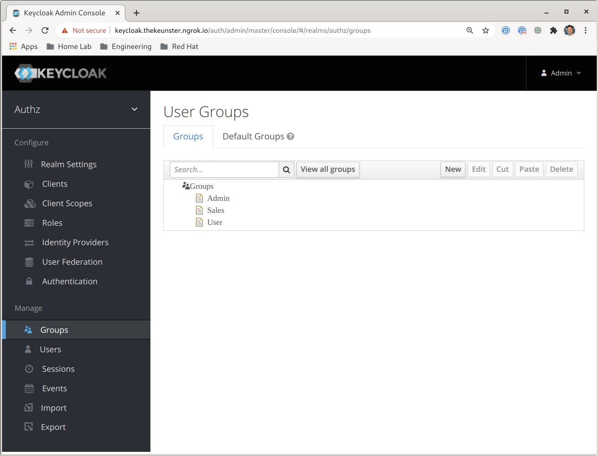
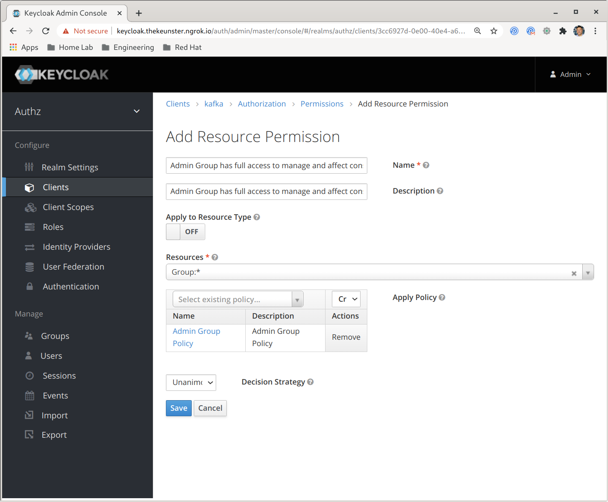

# Keycloak LDAP Setup

## Open the Keycloak Administration Dashboard

You can access the keycloak web ui a few different ways. 

### Kubernetes

#### Leveraging a Port Forward Proxy

one way to do to this is via port-forwarding your keycloak pod. 

```bash
# example - accessible at: https://localhost:8443
# obtain keycloak pod name. i.e. keycloak-69689547-fmn6h
kubectl -n keycloak port-forward keycloak-69689547-fmn6h 8443:8443
```

#### Go directly to the external address exposed by your load balancer service

This may not work for you depending on your cluster setup. Otherwise, you will need to proxy the address using port-forward or other means of forwarding (i.e. ngrok, etc.) -- see first option.

```bash
# this will list your services
# under external address, you should see an IP, 
# provided you have enabled load balancers in your cluster
# navigate to: https://<EXTERNAL-ADDRES>:8443
kubectl -n keycloak get svc keycloak
```

### Openshift

```bash
# open the url route to the Keycloak Web UI
# navigate to the route displayed after running the following command
oc -n keycloak get routes keycloak -o jsonpath='{ .spec.host }'
```

## Add an LDAP Provider and Import Users

1) Login to the main Keycloak dashboard

```bash
# Keycloak u/p
username: admin
password: admin
```

2) Select realm: `kafka-authz`

3) Select `User Federation` and then `ldap` from the provider drop down

4) Match your screen configuration to the illustration below

> We are using the following masked values in the form as shown in the illustration: `Bind Credential: admin`



We are using OpenLDAP as our LDAP provider in this example, hence the screen configurations will be specific to configuring OpenLDAP. 

Between other LDAP Providers, these configurations will differ.

5) click `save`, then click `Synchronize all users`

> All defined LDAP users in this example have password: `pass`

## Import LDAP Groups

1) select `User Federation` and then `ldap` 
2) select `Mappers`
3) click `create` and set name: `ldap-groups` and select mapper-type: `group-ldap-mapper`
4) fill the form in with the following values: 


4) click `save` and then `Sync LDAP Groups to Keycloak`

You can validate our LDAP users and groups by clicking on the `Users` and `Groups` tabs. 

You should see the following users: 



and groups: 



# IV. Broker Authorization

The following use cases will demonstrate how to create various broker authorization resources, policies, and permissions and test them via kafka consumer/producer tools. 

For each of the use cases below we will walk through in how to define them. 

We will add authorization rules on the `Admin` LDAP group we synchronized earlier. Observing the users in the group we see the group has two users, `kermit` and `fozzie`. 

To begin, select from the "Clients" tab, `kafka`, then select `Authorization`. 

From there you will be able to add/update additional resources, policies, and permissions. 

# V. Policies

## Admin Group Policy

**Resources**: `Group:*` 

**Form Fields**: 

- Name/Description: `Admin Group Policy`
- Groups: `Admin`
- Policy Type: `Group`


# VI. Permissions 

## Admin Group Policy has full access to manage and affect consumer groups

**Resources**: `Group:*`

**Policies**: `Admin Group Policy`

**Form Fields**: 

- Name/Description: `Admin Group Policy has full access to manage and affect consumer groups`
- Type: `Resource`
- Resource: `Group:*`
- Policy: `Admin Group Policy`
- Decision Strategy: `Unanimous`



## Admin Group Policy has full access to manage and affect producer topics

**Resources**: `Topic:*`

**Policies**: `Admin Group Policy`

**Form Fields**: 

- Name/Description: `Admin Group Policy has full access to manage and affect producer topics`
- Type: `Resource`
- Resource: `Topic:*`
- Policy: `Admin Group Policy`
- Decision Strategy: `Unanimous`


## Admin Group Policy has full access to config on any cluster

**Resources**: `Cluster:*`

**Policies**: `Admin Group Policy`

**Form Fields**: 

- Name/Description: `Admin Group Policy has full access to config on any cluster`
- Type: `Resource`
- Resource: `Cluster:*`
- Policy: `Admin Group Policy`
- Decision Strategy: `Unanimous`

